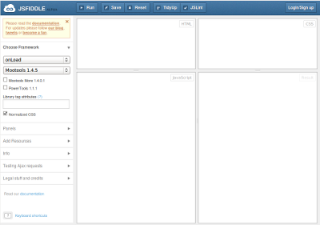
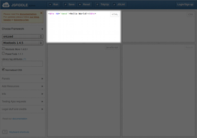
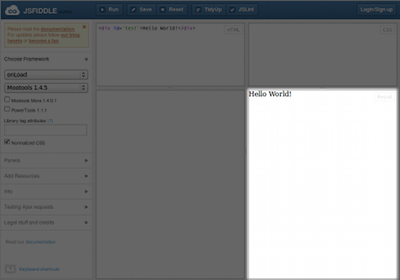
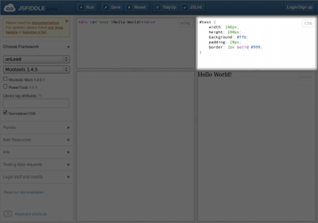
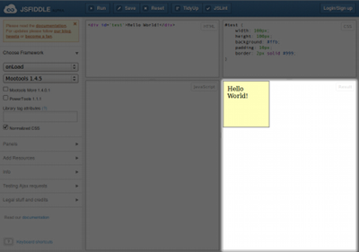
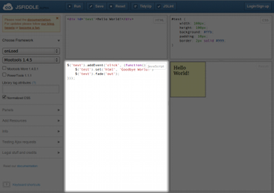
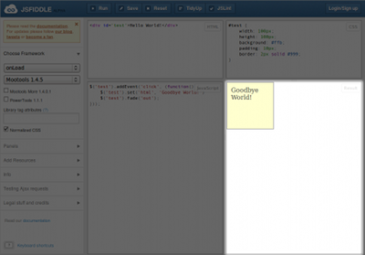

========
Tutorial
========

From the start, jsFiddle was built to be simple and intuitive to use.

This tutorial aims to help you write your first "Hello World" Fiddle, no
experience of HTML, CSS or JavaScript is required.

First Fiddle : "Hello World - Goodbye World"
--------------------------------------------

We are going to build a simple Hello World example in jsFiddle. It will
create a box that shows "Hello World!". We will also add a MooTools click
event that means when we click on the box, it change to say "Goodbye
World!" and fade out.

Open up jsFiddle
""""""""""""""""

First things first, open up `jsFiddle <http://jsfiddle.net/>`_ in a browser
window and put it somewhere you can easily switch between this tutorial and
that screen.

You will be greeted by the blank jsFiddle screen shown left, ready for your
beautiful creation.

You will see that there are four panes - three are for editing HTML, CSS
and JavaScript, we will enter code into each of these during the tutorial.

The final pane "Result" is where jsFiddle creates a page from our code -
our Hello World will appear here.

At the top of the screen are buttons for managing the Fiddle, and on the
left hand side are more detailed settings for the Fiddle. You won't need to
look at these now - they are addressed in the Advanced Usage section.

.. container:: clearer

    .. image:: _static/spacer.png

Create the Hello World HTML
"""""""""""""""""""""""""""

First we will work with the top left pane of the Fiddle - HTML.

Click inside that pane and enter the following HTML::

    
Hello World!

This will create a single `div` element, with an `id` of `test` and the
text "Hello World!" inside it.

.. container:: clearer

    .. image:: _static/spacer.png

Running Fiddles
"""""""""""""""

Now we need to run this first Fiddle. At the top left of jsFiddle is the
"Run Button".

Click the button and run your Fiddle now. jsFiddle will load your HTML,
CSS and JavaScript into the Result pane.

.. container:: clearer

    .. image:: _static/spacer.png

You should now see "Hello World!" appear in the Result pane.

Congratulations! You've just run your first Fiddle!

.. container:: clearer

    .. image:: _static/spacer.png

.. note::
    During the rest of this tutorial, you can run your first Fiddle
    whenever you want. We will use the run button icon to indicate that you
    should run your Fiddle to achieve a result.

Add some CSS, make it a box
"""""""""""""""""""""""""""

Now to make our Hello World look a little nicer, we shall add some CSS to
make it into a box.

We are going to work with the top right pane - CSS.

Click inside that pane and enter the following CSS code::

    #test {
        width: 100px;
        height: 100px;
        background: #ffb;
        padding: 10px;
        border: 2px solid #999;
    }

This will style the element with `id` of "test" to have a fixed width and
height of 100 pixels, plus give it a background and border.

.. container:: clearer

    .. image:: _static/spacer.png
        :height: 20

Run your Fiddle, a newly styled Hello World box should appear.

.. container:: clearer

    .. image:: _static/spacer.png

Add the JavaScript, make it clickable
"""""""""""""""""""""""""""""""""""""

Now we add some JavaScript to make the box listen for our click.

We are going to work with the bottom left pane - JavaScript.

Click inside the JavaScript pane and enter this code::

    $('test').addEvent('click', (function() {
        $('test').set('html', 'Goodbye World!')
        $('test').fade('out');
    }));

We are using MooTools (jsFiddle's default library) to do a number of
things:

* Find the element with an `id` of "test".
* Add a 'click' event to that element which calls an anonymous function.
* That function changes the text of the element to say "Goodbye World!" and
  then sets the element to fade out using the MooTools function `fade()`.

.. container:: clearer

    .. image:: _static/spacer.png
        :height: 20

Run your Fiddle with your new JS.

.. container:: clearer

    .. image:: _static/spacer.png

At first everything should appear the same.

However, try clicking on the "Hello World" box.

If everything went OK, then the box should change its text and fade out
when clicked.

.. container:: clearer

    .. image:: _static/spacer.png

Well done
"""""""""

Congratualations! You've created your first Fiddle with HTML, CSS and
JavaScript based on the MooTools library!

**Did something not work?**
    If you had a problem getting this tutorial to run, go back and check
    that the code you entered matches the examples. If you still have
    problems, you can check against `this copy of the tutorial example
    <http://jsfiddle.net/james/c94GL/>`_.

Next steps
----------

You're ready to jump off into the world of jsFiddle.

Now is a good time to look at some more complex examples and start
experimenting.

* `jQuery Element Stacks <http://jsfiddle.net/marcofucci/rRtAq/>`_
* `Delayed Mouse Tracking with Processing <http://jsfiddle.net/zalun/FZqZN/>`_
* `Andrew Wooldridge's List of Stunning examples
  <http://andrewwooldridge.com/blog/2011/03/16/stunning-examples-of-using-jsfiddle/>`_

Have questions? `Check out the FAQ <Frequently asked questions>`_.
